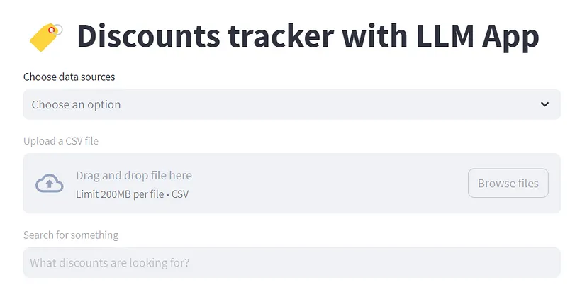

# Amazon Discounts App

In this tutorial, we will build an app called "Amazon Discounts App" that can find real-time sales and deals for Amazon products by leveraging the LLM App library.&#x20;

In this case, instead of cloning this Discounts app repository, we'll try to observe and learn how it uses the [LLM App with the Prices API](https://github.com/Boburmirzo/chatgpt-api-python-sales) to give the desired results.

<figure><figcaption></figcaption></figure>

In this app, we have two data sources:

* [Rainforest API for Amazon Prices](https://www.rainforestapi.com)
* Discounts CSV with product and prices data

These two sources are used to show how you can upload a CSV along with another data source. While you can use a similar approach with other APIs, even this showcase opens up considerable possibilities in E-Commerce applications.&#x20;
