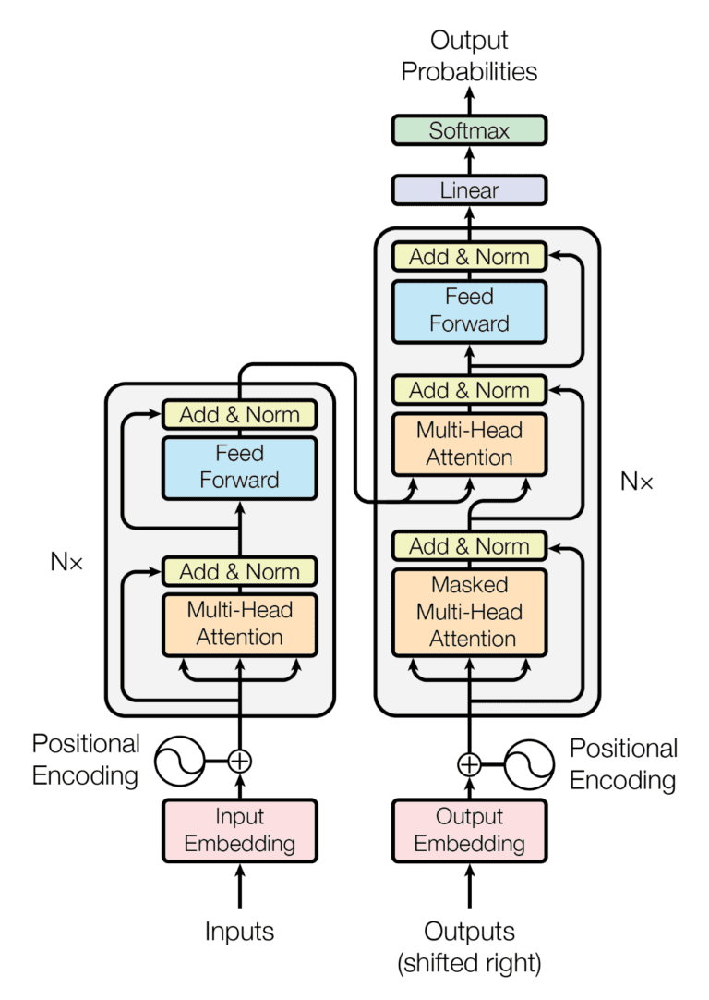

# Multi-Head Attention and Further Reads (Bonus Module)

Building on the foundation of self-attention, Transformers use a more refined approach using the concept of **Multi-Head Attention**. This mechanism enhances the model's ability to focus on different parts of the input for various reasons.

### Let's understand Multi-Head Attention.

The basic idea of multi-head attention is simple. Think of Multi-Head Attention as having several pairs of eyes (or "heads") looking at the same sentence. Each pair of eyes focuses on different parts of the sentence, capturing various details.

* How it makes a difference: Normally, in attention mechanisms, we use one set of Q (query), K (key), and V (value) to understand the sentence. In Multi-Head Attention, we split this process into <mark style="color:blue;background-color:yellow;">several smaller parts</mark>, each with its own Q, K, and V. This means we can pay attention to different parts of the sentence simultaneously.
* This method allows us to get a richer understanding of the sentence. Each head might notice different things - some might focus on grammar, while others might look for emotion or specific keywords.

Example in Simple Code:

Suppose we decide to have two heads. Here's a simple way to visualize this in code:


```python
# Let's say we have 2 heads
number_of_heads = 2

# We divide Q, K, and V for each head
divided_Q = np.split(Q, number_of_heads)
divided_K = np.split(K, number_of_heads)
divided_V = np.split(V, number_of_heads)

# Now, each head does its own attention
attention_results = []
for q, k, v in zip(divided_Q, divided_K, divided_V):
    attention_results.append(calculate_attention(q, k, v))

# Finally, we combine the results from each head
combined_attention = np.concatenate(attention_results)
```


In summary, Multi-Head Attention allows Transformers to process information in parallel, significantly enhancing their ability to understand and interpret complex language data by examining it from multiple perspectives simultaneously.

#### Sample Implementation

* **Creating Multiple Heads**: You create several sets of weight matrices (for Q, K, V) corresponding to the number of heads.
* **Applying Attention Independently**: Each head performs the attention mechanism independently, as we did with single-head attention.
* **Combining Outputs**: Finally, the outputs from all heads are concatenated and possibly linearly transformed to produce the final output.

### Role of Positional Encodings

Transformers, in addition to Multi-Head Attention, employ Positional Encodings to understand word order, which is vital for processing sentences. This technique assigns a sequence number to each word, such as \[("Building", 1), ("LLM", 2), ("Apps", 3)], enabling the Transformer to identify the order of words even when processing them all at once. This is crucial because, unlike sequential models like RNNs that naturally read words one by one, Transformers work on entire sentences simultaneously using parallel processing, making them fast but initially unaware of word order – a gap filled by Positional Encodings.

Positional Encodings aren’t limited to simple integer incremental sequences like in the case of \[("Building", 1), ("LLM", 2), ("Apps", 3)]. There are various methods to calculate them. The authors of the Transformer model used a more complex approach. Their method uses sinusoidal waves of different frequencies, allowing the model to attend to relative positions in the input sequence effectively.

$$PE(pos, 2i) = \sin\left(\frac{pos}{10000^{2i/d_{\text{model}}}}\right)$$ and $$PE(pos, 2i+1) = \cos\left(\frac{pos}{10000^{2i/d_{\text{model}}}}\right)$$

The first formula here is for calculating PE (Positional Encodings) for even indices (2i) and the second one is for odd indices. In these formulas, `pos` refers to the position in the sequence, `i` is the dimension, and  $$d_{\text{model}}$$ is the dimension of the model.

### Putting it together: Transformers Architecture

<figure><figcaption><p>Source: Attention Is All You Need" by Vaswani et al</p></figcaption></figure>

The Transformer model's architecture, prominently featuring an Encoder and a Decoder, is a marvel of design in language processing. The left side of the diagram is the Encoder: This part of the model processes the input data. The right side is the Decoder, which is responsible for generating the output based on the processed input from the Encoder.&#x20;

By now, you can already recognize a few of the components in this diagram. Before we quickly summarize how it works, let's cover some key components we haven't discussed yet.

* **Feed Forward Neural Network**: Present in each layer of both the Encoder and Decoder, these neural networks perform additional transformations on the data. It's crucial for capturing complex patterns in data, making the model better at handling language nuances.&#x20;
* **Add & Norm**: It's a bit like double-checking work. This step, included in every layer, involves adding the original input back into the output (residual connection) and then normalizing it. This is vital for addressing a common issue in training deep networks known as the vanishing gradient problem. In simpler terms, as a network learns, updates to its weights can become very small, almost "vanishing." This makes learning very slow or even stops it. The residual connections help by ensuring that there’s always a flow of gradients, keeping the learning process alive and effective.
* **Linear Layer and Softmax in Decoder**: The Decoder ends with a Linear layer and a Softmax function. Hence these components are key to generating the output sequence. The Linear layer predicts the next word, and Softmax turns these predictions into probabilities. This combination ensures the model selects the most appropriate next word, building the output sequence one word at a time.

#### Bringing It All Together

1. **Processing the Input**: In the Encoder, the input sentence is processed with attention mechanisms and positional encodings, capturing its full context in parallel.
2. **Generating the Output**: The Decoder, using the processed data from the Encoder, attentively constructs the output, ensuring each word fits accurately in the sequence.
3. **Parallel Efficiency**: This parallel processing approach marks a significant advancement over older sequential models, making the Transformer faster and more adept at understanding and generating language.

### Video Lecture on Transformers by Andrej Karpathy

To deepen your grasp of transformers in AI, consider exploring a lecture by Andrej Karpathy, who has made significant contributions to AI, including leading the AI team at Tesla. His session at Stanford University offers a comprehensive look at the role of transformer models in modern AI applications, making it a valuable resource for those keen to understand this advanced technology.

**Key Takeaways of the Session:**

* Overview of transformers, focusing on their role in generative models and potential in advanced applications like video understanding.
* Evolution from conventional neural networks to transformers, highlighting their impact in natural language processing and machine translation.
* A detailed look at the transformer's learning process, including multi-headed attention and backpropagation, for efficient data handling.
* Discussion on causal self-attention in transformers, crucial for accurate future predictions in applications like those at Tesla.
* The transformer's versatility and future potential, with a nod to possible advancements in AI learning and application breadth.



### Bonus Resource: Lecture on Vision Transformers by Dr. Vijay S Agneeswaran

After exploring Transformers architecture, consider viewing a session at IIT Guwahati, which is available on [Pathway's YouTube channel](https://www.youtube.com/@pathwaycom). This session, featuring Vijay, a Senior Director and ML Research Leader at Microsoft, sheds light on the latest in computer vision, vision transformers, and their role in Large Language Models (LLMs).

**Key Takeaways of the Session:**

* The transition from traditional convolutional networks to pre-trained transformers in computer vision.
* The synergy between these advanced transformers and LLMs leading to enhanced image classification and other tasks.
* Insight into Scattering Vision Transformers (SVT), detailing their development, technical aspects, and performance.
* Demonstration of SVT's leading performance in tasks like image classification (ImageNet dataset) and instance segmentation (MSCoco dataset).



### Resources for Further Study

Further Study

To delve deeper into the intricacies of Transformers and Multi-Head Attention, here are some resources you can explore:

1. [**Original Paper**](https://proceedings.neurips.cc/paper\_files/paper/2017/file/3f5ee243547dee91fbd053c1c4a845aa-Paper.pdf): "Attention Is All You Need" by Vaswani et al. - This seminal paper introduced the Transformer model. It's a must-read for understanding the theoretical foundations.
2. [**The Illustrated Transformer**](http://jalammar.github.io/illustrated-transformer/): An accessible and visually-oriented explanation of how Transformers work, including Multi-Head Attention.
3. [**Jan Chorowski's Course Materials**](https://github.com/janchorowski/dl\_uwr/tree/summer2021/Lectures)**:** Dive into a comprehensive collection of materials for Jan's Deep Learning and Neural Networks course at the University of Wrocław.&#x20;
4. [**BERT Explained**](https://blog.research.google/2018/11/open-sourcing-bert-state-of-art-pre.html): A deep dive into BERT, a groundbreaking Transformer model, which revolutionized the field of NLP.

These resources will guide you through the theoretical concepts, practical implementations, and the broader impact of Transformers and Multi-Head Attention in the field of natural language processing.
